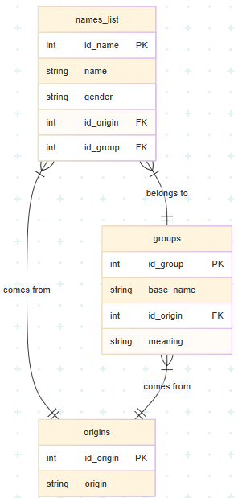

# 1000 Meanings  
A relational SQL database for exploring names, their meanings, and origins  
By Giuliana Mendonça

## About the Project
[20000-names.com](https://www.20000-names.com/) is an online archive of names from a wide range of languages, cultures, and historical periods. However, its content is presented in long, unstructured web pages, which makes deep searching or filtering difficult, especially when looking by meaning or cultural background.

The **1000 Meanings** project transforms a selection of that data into a normalized, query-ready SQL database. The goal is to support flexible, meaningful searches by:

- Name
- Meaning
- Origin

This makes the database useful for everything from casual name exploration to character creation or cultural research.

## What's Included
### Database Schema


The database includes three main tables:
- `names_list` - approximately 1000 name variants, each linked to a group, an origin, and a gender
- `groups` - root versions of names (base forms) and their shared meanings
- `origins` - languages or regions where name variants are used

### Views
Three views are defined to simplify common queries:
- `names_origins` - joins `names_list` and `origins`
- `groups_origins` - joins `groups` and `origins`
- `full_version` - joins all three tables, giving access to names, meanings, and origins

### Indexes
Indexes were created on key fields to improve performance:
- `origins`: `id_origin`, `origin`
- `groups`: `id_group`
- `names_list`: `id_name`, `name`

## Sample Data
Three `.csv` files are provided with sample data for testing and exploration:
- `names_list.csv` - name variants with their associated group, origin, and gender
- `groups.csv` - root names with shared meanings and origins
- `origins.csv` - list of languages or regions

## Setup and Usage
To populate and explore the database:
1. Run the import file in SQLite (CLI or GUI):
   ```
   sqlite3 names.db < import.txt
   ```

   This file will:
   - Read the schema from `schema.sql`
   - Load the `.csv` files into the appropriate tables

2. Open the database and run example queries from `queries.sql` to test functionality or explore data relationships.

## Limitations
- The database does not support free-text notes or user-generated content
- Only one origin and one meaning are allowed per name entry - hybrid/multi-origin cases are handled as multiple entries
- All data comes from a single reference source ([20000-names.com](https://www.20000-names.com/)) and may reflect gaps or inconsistencies from the original material

## About
This project was developed as the final assignment for CS50's Introduction to Databases with SQL.  
All formatting, modeling, and cross-referencing were done manually by Giuliana Mendonça.
